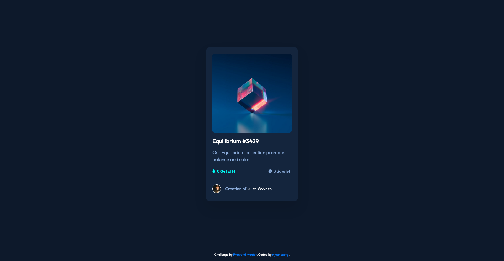

# Frontend Mentor - NFT Preview Card Component

This is a solution to the [NFT preview card component challenge on Frontend Mentor](https://www.frontendmentor.io/challenges/nft-preview-card-component-SbdUL_w0U). Frontend Mentor challenges help you improve your coding skills by building realistic projects.

## Table of contents

- [Overview](#overview)
  - [The challenge](#the-challenge)
  - [Screenshot](#screenshot)
  - [Links](#links)
- [My process](#my-process)
  - [Built with](#built-with)
  - [What I learned](#what-i-learned)
- [Author](#author)
- [Acknowledgments](#acknowledgments)

## Overview

### The challenge

Users should be able to:

- View the optimal layout depending on their device's screen size
- See hover states for interactive elements

### Screenshot



### Links

- Solution URL: [GitHub Respository](https://github.com/juancaorg/nft-preview-card)
- Live Site URL: [nftpreviewcard.juanca.dev](https://nftpreviewcard.juanca.dev)

## My process

### Built with

- Semantic HTML5 markup
- CSS custom properties
- CSS Flexbox
- CSS Grid
- Mobile-first workflow

### What I learned

I struggled on how to overlap elements in CSS. The "obvious choice" would be to use `position: absolute`.

However, there's a better way using CSS Grid.

Using CSS Grid, you can set all the grid items to be in the same cell.

```css
/* for block elements */
.layered {
  display: grid;
}

.layered > * {
  grid-column-start: 1;
  grid-row-start: 1;
}

/* or for inline elements */
.inline-layered {
  display: inline-grid;
}

.inline-layered > * {
  grid-column-start: 1;
  grid-row-start: 1;
}
```

Adding the layered class to an element causes all it's children to be layered on top of each other.

**Demo:**

```css
.layered {
  display: grid;

  /* Set horizontal alignment of items in, case they have a different width. */
  /* justify-items: start | end | center | stretch (default); */
  justify-items: start;

  /* Set vertical alignment of items, in case they have a different height. */
  /* align-items: start | end | center | stretch (default); */
  align-items: start;
}

.layered > * {
  grid-column-start: 1;
  grid-row-start: 1;
}

/* for demonstration purposes only */
.layered > * {
  outline: 1px solid red;
  background-color: rgba(255, 255, 255, 0.4);
}
```

```html
<div class="layered">
  
  <p>2</p>
  <div>
    <p>Third layer</p>
    <p>Third layer continued</p>
    <p>Third layer continued</p>
    <p>Third layer continued</p>
  </div>
</div>
```

And that's how I made the overlay overlap the image, basically.

## Author

- Website - [juanca.org](https://www.juanca.org)
- Frontend Mentor - [@juancaorg](https://www.frontendmentor.io/profile/juancaorg)
- Twitter - [@juancaorg](https://www.twitter.com/juancaorg)

## Acknowledgments

Huge shoutout to [Arye Eidelman](https://stackoverflow.com/users/3458162/arye-eidelman) for his response on [Stack Overflow](https://stackoverflow.com/questions/2027657/overlapping-elements-in-css) on how to overlap elements in CSS.
